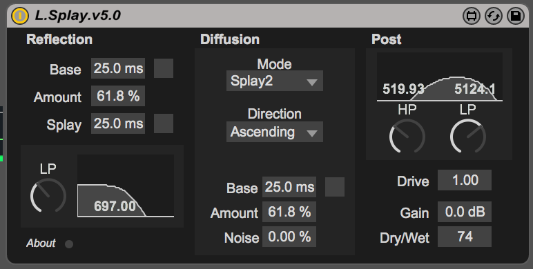

# L.Splay

> [Max For Live][m4l] Audio Effect Device:
  An atypical reverb / delay effect capable of producing very
  lush mono or stereo washes, tight metallic can-like resonances,
  and noisy yet smooth textures.

---

Find more free devices at [lokua.net][l4l]

## License
MIT © [Joshua Kleckner][jjk]

[jjk]: https://lokua.net
[l4l]: https://lokua.net/for-live
[m4l]: https://www.ableton.com/en/live/max-for-live/
